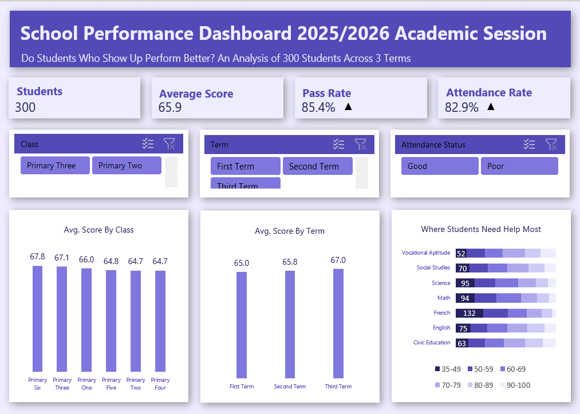
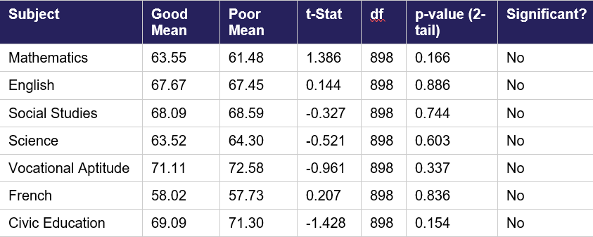
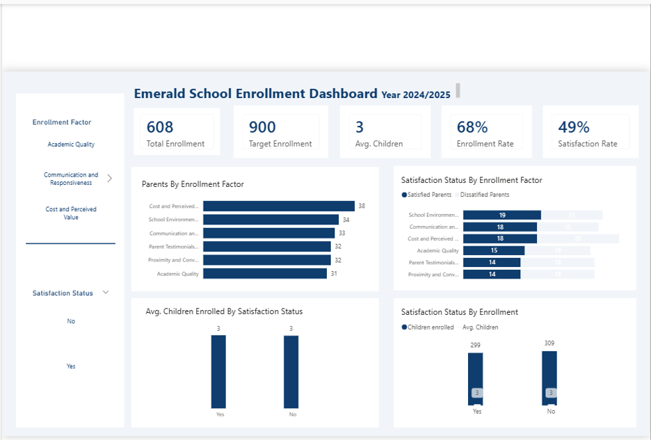

# Data_Analytics_Portfolio
## ABOUT ME

Hello! I'm Aurelia Okafor 🤓, a data analyst  with a strong interest in transforming educational and operational data into meaningful insights that support data-driven decision-making. I enjoy working with data to uncover patterns, trends, and opportunities for improvement.

 

<!--Mention your top/relevant skills here - core and soft skills-->

## Core Skills (Technical Skills)

As a data analyst, I possess strong technical skills that enable me to collect, clean, analyze, and visualize data effectively to support decision-making.

- **Data Analysis & Cleaning:** Preparing, validating, and transforming raw data to ensure accuracy and reliability  
- **Excel:** Advanced formulas, pivot tables, dashboards, data validation, and reporting  
- **SQL:** Writing complex queries using joins, subqueries, aggregations, and filtering to extract insights from databases  
- **Power BI:** Data modeling, DAX calculations, interactive dashboards, and performance reporting  
- **Tableau:** Creating clear, insightful visualizations and dashboards for data storytelling  
- **Data Visualization:** Presenting insights in a visually compelling and easy-to-understand format  
- **Reporting & Documentation:** Translating analysis results into actionable reports and presentations  

---

## Soft Skills

In addition to technical expertise, I bring strong soft skills that are essential for effective data analysis and collaboration.

- **Analytical & Critical Thinking:** Ability to interpret data, identify patterns, and draw meaningful conclusions  
- **Problem-Solving:** Using data-driven approaches to address business and operational challenges  
- **Attention to Detail:** Ensuring data accuracy, consistency, and integrity throughout the analysis process  
- **Communication Skills:** Explaining complex data insights clearly to both technical and non-technical stakeholders  
- **Collaboration & Teamwork:** Working effectively with cross-functional teams to achieve shared goals  
- **Time Management:** Managing multiple tasks and deadlines efficiently  
- **Adaptability & Continuous Learning:** Staying current with evolving tools, techniques, and industry trends  

---

<!--Section 2: List 3-4 key projects-->
## MY PORTFOLIO 

*Have a look at some of the projects I have done.*

# Student Attendance and Performance Analysis
---
## Table of Contents

 Student Attendance and Performance Analysis

1.<a href= "#project-overview">Project Overview  </a>  
2.<a href= "#business-problem">Business Problem  </a>  
3.<a href = "#objective">Objective  </a>  
4.<a href ="#tools-used">Tools Used  </a>  
5.<a href="#process">Process  </a>  
6.<a href= "#key-insights">Key Insights  </a>  
7.<a href = "#recommendations">Recommendations  </a>  
8.<a href = "#connect-with-me">Connect With Me</a>  

 UTME Student Performance Analysis

 

1.<a href= "#project-overview-1">Project Overview  </a>  
2.<a href= "#business-problem-1">Business Problem  </a>  
3.<a href = "#objective-1">Objective  </a>  
4.<a href ="#tools-used-1">Tools Used  </a>  
5.<a href="#process-1">Process  </a>  
6.<a href= "#key-insights-1">Key Insights  </a>  
7.<a href = "#recommendations-1">Recommendations  </a>  
8.<a href = "#connect-with-me-1">Connect With Me</a>  

 Emerald School Enrollment Analysis

 

1.<a href= "#project-overview-2">Project Overview  </a>  
2.<a href= "#business-problem-2">Business Problem  </a>  
3.<a href = "#objective-2">Objective  </a>  
4.<a href ="#tools-used-2">Tools Used  </a>  
5.<a href="#process-2">Process  </a>  
6.<a href= "#key-insights-2">Key Insights  </a>  
7.<a href = "#recommendations-2">Recommendations  </a>  
8.<a href = "#connect-with-me-2">Connect With Me</a>  

 Daisy School Lead Generation and Conversion Analysis

 

1.<a href= "#project-overview-3">Project Overview  </a>  
2.<a href= "#business-problem-3">Business Problem  </a>  
3.<a href = "#objective-3">Objective  </a>  
4.<a href ="#tools-used-3">Tools Used  </a>  
5.<a href="#process-3">Process  </a>  
6.<a href= "#key-insights-3">Key Insights  </a>  
7.<a href = "#recommendations-3">Recommendations  </a>  
8.<a href = "#connect-with-me-3">Connect With Me</a>  

---
## Project Overview
This project is an Excel/Power Pivot academic performance dashboard built for Daisy School, analyzing 300 students across 3 terms (First, Second, Third) and 7 subjects (Mathematics, English, Social Studies, Science, Vocational Aptitude, French, and Civic Education) for the 2025/2026 academic session. The dashboard was designed to answer one central question: **Do students who show up perform better?**  
The analysis combined a star-schema data model, DAX measures, and inferential statistics (t-tests) to investigate the relationship between attendance and academic performance, identify subjects where students struggle most, and surface class- and term-level performance trends to support school leadership decision-making.

--- 

## Business Problem
School leadership lacked a consolidated view to:  
•	Track student performance across classes, terms, and subjects in one place  
•	Understand whether attendance meaningfully drives academic outcomes  
•	Identify which subjects and score bands need the most intervention  
•	Spot early warning signs of declining performance at the class level  
•	Make evidence-based decisions on where to focus support and resources  

---
## Objective
The goal of this project was to:  
•	Consolidate 300 students’ academic and attendance records into a single data model  
•	Calculate core KPIs: total students, average score, pass rate, and attendance rate  
•	Compare performance across classes, terms, and attendance status (Good vs Poor)  
•	Statistically test whether attendance has a significant effect on scores  
•	Identify the subjects and score bands where students are struggling most  
•	Translate findings into actionable recommendations for the school  

---
## Tools Used
•	Microsoft Excel  
•	Power Pivot (Data Model)  
•	DAX (Data Analysis Expressions)  
•	Power Query  
•	Inferential Statistics (Independent t-tests)  
•	PowerPoint for report packaging  

---
## Process
The following steps were carried out during the analysis:  
1.	Establishing a clean star schema linking students, scores, attendance, and subjects  
2.	Cleaned and transformed raw score and attendance records using Power Query  
3.	Wrote DAX measures for Total Students, Average Score, Pass Rate, and Attendance Rate  
4.	Segmented students into Good vs Poor attendance status and compared performance outcomes  
5.	Ran independent t-tests across all 7 subjects to test whether the attendance-performance gap was statistically significant  
6.	Designed a dashboard with KPI cards, conditional formatting, slicers, and a 100% stacked bar chart for score band breakdowns  

---

## Key Insights
### Overall Performance
•	300 students analyzed across 3 terms  
•	Pass Rate: 85.4%  
•	Attendance Rate: 82.9%  
•	Average score improved steadily across the academic year — 65.0 (First Term) → 65.8 (Second Term) → 67.0 (Third Term)  

---
### Attendance vs. Performance
•	Counterintuitively, students with poor attendance scored higher on average (90.0%) than students with good attendance (84.4%)  
•	This finding was statistically confirmed via independent t-tests across all 7 subjects (all p > 0.05), meaning attendance status did not show a statistically significant effect on scores  
•	Rather than suggesting an advantage to absenteeism, this likely reflects the intermittent nature of the absences recorded. Missed classes were scattered rather than consecutive, allowing students to re-engage with lesson content and recover lost ground with teacher support, without major disruption to their academic trajectory  

---
### Independent t-test results (Good vs. Poor attendance) by subject:

All seven subjects returned p-values well above the 0.05 significance threshold, confirming that the difference in academic performance between Good and Poor attendance groups is not statistically significant.

---
### Class-Level Trends
•	Primary 2 pass rates declined steadily across the year  from 83.3% (Term 1) to 80% (Term 2) to 78.6% (Term 3) ;  a pattern likely driven by students accumulating consecutive absences, which made recovering missed content increasingly difficult  

---
### Subject-Level Struggles
•	Across both attendance groups, French, Science, and Mathematics emerged as the three subjects where students struggled most  
•	French was the highest-concern subject overall, with the largest concentration of students in the 35–49 score band (132 students)  

---
## Recommendations
### 1. Targeted Subject Support
Prioritize intervention programs in French, Science, and Mathematics, the three subjects where students across all attendance groups consistently underperformed.

---
### 2. Consecutive Absence Monitoring
Implement an early alert system to flag students who miss school on consecutive days, enabling timely academic catch-up support before learning gaps widen.

---
### 3. Structured Catch-Up Programs
Establish a formal catch-up framework like remedial classes or peer tutoring to ensure students returning from any absence can recover missed content without falling behind.

---
### 4. Whole-School Attendance Culture
While intermittent absences showed minimal academic impact, the school should still reinforce consistent attendance habits through parental engagement and awareness campaigns to prevent absences from becoming chronic.

---
### 5. Teacher Training & Support for Low-Scoring Students
Prioritize professional development programs that equip teachers with evidence-based strategies for identifying and supporting academically vulnerable learners, particularly those scoring within the 35–49 range, where subject-level struggle is most concentrated and the risk of further decline is highest.

---
### Connect With Me

#### Let's Connect!

•	LinkedIn: [My profile](https://www.linkedin.com/in/aureliaaokafor)
•	Project LinkedIn Post: [View post](https://www.linkedin.com/posts/aureliaaokafor_attendance-analytics-when-data-challenges-activity-7476230166747209728-sZhk)

# UTME Student Performance Analysis

---

## Project Overview

This project is an Excel dashboard built for Bright School, analyzing the UTME (Unified Tertiary Matriculation Examination) performance of 300 students across subject categories, gender, and school status (Boarding vs Day) for March 2026. The dashboard was designed to answer one central question: Are students adequately prepared for UTME examinations, and which student groups are meeting the school's benchmark score?  

The analysis combined Pivot Tables, Pivot Charts, and Slicers to track performance trends, assess target achievement rates, and surface actionable insights to support data-driven academic preparation strategies.

---

 

---

## Business Problem

Following the release of the 2026 UTME results, school management lacked a consolidated view to:

- Understand whether students were adequately prepared for the UTME examination  
- Identify which student groups were performing better or below expectations  
- Evaluate whether the school's target score benchmark of 300 was being achieved by a significant proportion of students  
- Compare performance across subject categories, gender, and school status  
- Make data-driven decisions to improve academic preparation strategies and student support programs  

---

## Objective

The goal of this project was to:

- Determine the total number of students who participated in the UTME examination  
- Calculate the average UTME score across all students  
- Identify how many students achieved the target score of 300 and above  
- Measure the achievement rate (%) of students who met the target score benchmark  
- Analyze gender distribution and compare male vs female performance  
- Identify which subject category recorded the highest and lowest average UTME scores  
- Compare average performance between Day and Boarding students  
- Investigate the relationship between CBT practice frequency and student performance  
- Identify which subject category contributed the highest number of students achieving the target score  

---

## Tools Used

- Microsoft Excel  
- Pivot Tables  
- Pivot Charts  
- Slicers  
- DAX  

---

## Process

The following steps were carried out during the analysis:  

1. Cleaned and structured raw student data including demographics, subject categories, CBT practice frequency, extension class participation, school status, and UTME scores  
2. Built Pivot Tables to summarize performance across subject categories, gender, and school status  
3. Created Pivot Charts to visualize student distribution, average scores by subject category, and target achievement rates  
4. Connected Slicers for Gender, Subject Category, and School Status to enable dynamic filtering  
5. DAX measures were written to calculate the key performance indicators, including Total Students, Average UTME Score, Target Achievement Count, and Achievement Rate (%), before being displayed as KPI cards on the dashboard.  

6. Designed KPI cards for Students, Average Score, Target Score, and Achievement Rate  
7. Packaged findings into a PowerPoint report deck  

---

## Key Insights

### Overall Performance

- 300 students analyzed across 4 subject categories  
- Average UTME Score: 306  
- Target Score: 300  
- Achievement Rate: 57% ( meaning only 57 out of every 100 students met the school's benchmark score)  

---

### Subject Category Performance

- Commercial students recorded the highest average UTME score (308)  
- Art followed at 306, then Science/Tech at 305, and Science at 304  
- Science students had the lowest target achievement rate (55%) across all subject categories  

---

### Gender Performance

- Female students: 152    
- Male students: 148  
- Male students achieved a higher target achievement rate (61%) than female students (53%)  
- Gender distribution was nearly balanced, making the performance gap a notable finding worth investigating further  

---

### Target Achievement by Subject Category

- Science/Tech: 56% achieved the target score of 300, leaving 44% still below the benchmark  
- Science: 55% met the target score of 300, with the remaining 45% falling short of the benchmark  
- Commercial: 64% achieved the target score of 300, though more than a third of the group missed the target  
- Art: 53% reached the target score of 300, while 47% remained below the expected standard  

---

## Recommendations

### 1. Investigate and Replicate Commercial Student Success
Commercial students consistently outperformed other subject categories. School management should investigate and document the practices, teaching approaches, and student habits driving this performance, then share them across other subject groups.

### 2. Targeted Academic Support for Lower-Performing Students
Students in Art, Science and Science/Tech categories showed the highest target miss rates. Structured intervention programs including remedial sessions, mentoring, and subject-specific support should be prioritized for these groups.

### 3. Expand CBT Practice Sessions
Given that CBT (Computer-Based Testing) is the UTME exam format, increasing the frequency and quality of CBT practice sessions can directly improve student readiness and reduce exam-day performance anxiety.

### 4. UTME-Focused Professional Development for Teachers
Equip teachers particularly those handling Art, Science and Science/Tech subjects with exam-focused teaching strategies, past question analysis, and data literacy skills to better support student preparation.

### 5. Investigate Gender Performance Gap
The 8-percentage-point gap between male (61%) and female (53%) achievement rates warrants further investigation. Understanding the contributing factors will help the school design targeted support for female students.

### 6. Track Achievement Rates Regularly
Establish a regular monitoring cycle; termly or quarterly to track student achievement rates over time, identify improvement trends, and catch performance declines early before they compound.

---

## Connect With Me

- LinkedIn:[My profile](https://www.linkedin.com/in/aureliaaokafor)
- Project LinkedIn Post: [View post](https://www.linkedin.com/posts/aureliaaokafor_utme-student-performance-analysis-activity-7467151675875569664-chZr)

# Emerald School Enrollment Analysis

---

## Project Overview

This project is a Power BI enrollment dashboard built for Emerald School, analyzing 200 parents and 608 students enrolled across 6 enrollment factors and 2 satisfaction groups (Satisfied and Dissatisfied) for the 2024/2025 academic year. The dashboard was designed to answer one central question: What drives school enrollment, and does it lead to parent satisfaction?  

The analysis investigated which enrollment factors were most influential in driving parents' decisions to enroll their children, assessed whether those factors were also translating into parent satisfaction, and identified the retention and referral risks posed by dissatisfied parents; all to support data-driven enrollment strategy decisions for school management.
 
---

---

## Business Problem

School management lacked a consolidated view to:  

- Identify which enrollment factors were most influential in parents' decision to enroll their children  
- Understand whether the factors driving enrollment were also leading to parent satisfaction  
- Determine why nearly half of enrolled parents reported dissatisfaction after enrollment  
- Assess how satisfaction levels related to the number of children enrolled per family  
- Identify which enrollment factors carried the highest risk of dissatisfaction and potential student churn  
- Make evidence-based decisions to improve retention and future referral rates  

---

## Objective

The goal of this project was to:  

- Determine the total number of students enrolled and compare it against the school's target of 900  
- Calculate core KPIs: total enrollment, target enrollment, average children per family, enrollment rate, and satisfaction rate  
- Identify which enrollment factor attracted the highest number of parents to the school  
- Compare the number of satisfied versus dissatisfied parents after enrollment  
- Identify which enrollment factors were associated with the highest and lowest parent satisfaction rates  
- Compare the number of children enrolled by satisfied versus dissatisfied parents  
- Identify which enrollment factors posed the greatest risk of dissatisfaction and student churn  
- Translate findings into actionable recommendations for the school  

---

## Tools Used  

- Power BI  
- DAX (Data Analysis Expressions)  
- Power Query  
- Excel (data preparation)  

---

## Process

The following steps were carried out during the analysis:  

1. Cleaned and structured raw enrollment data including parent demographics, enrollment factors, satisfaction status, school status, and number of children enrolled per family  
2. Built a data model in Power BI connecting enrollment factors, satisfaction status, and student counts  
3. DAX measures were written to calculate the key performance indicators: Total Enrollment, Target Enrollment, Enrollment Rate, Average Children, and Satisfaction Rate  before being displayed as KPI cards on the dashboard  
4. Segmented parents into Satisfied and Dissatisfied groups and compared enrollment counts and average children per family across both groups  
5. Analyzed satisfaction rates by enrollment factor to identify which factors drove the highest and lowest satisfaction  
6. Designed an interactive dashboard with KPI cards, slicers for Enrollment Factor and Satisfaction Status, bar charts for parent distribution and satisfaction by factor, and a satisfaction by enrollment comparison view  
7. Packaged findings into a PowerPoint report deck  

---

## Key Insights

### Overall Enrollment

-608 students enrolled against a target of 900, an enrollment rate of 68%  
-Satisfaction Rate: 49%, meaning only 49 out of every 100 enrolled parents were satisfied, revealing a significant gap between enrollment experience and expectations  
- Average children enrolled per family:3, consistent across both satisfied and dissatisfied groups  

---

### Enrollment Factors

-Cost & Perceived Value was the strongest enrollment driver, attracting 38 parents yet it was also among the top factors associated with dissatisfaction  
- Academic Quality attracted the fewest parents (31), suggesting it is not the primary motivator for enrollment decisions at this school  
- Enrollment factors were effective at attracting families, but the higher number of children enrolled by dissatisfied parents suggests initial expectations were not fully met during the enrollment experience creating a retention and referral risk  

---

### Satisfaction vs. Dissatisfaction

- 98 parents were satisfied and enrolled 299 children  
- 102 parents were dissatisfied and enrolled 309 children, meaning more children are at retention risk than those in satisfied households  
- School Environment recorded the highest satisfaction count (19 satisfied parents) among all enrollment factors  
- Cost & Perceived Value and Parent Testimonials/Recommendations recorded the highest dissatisfaction signaling a disconnect between word-of-mouth expectations and actual school experience  

---

## Recommendations

### 1. Review Cost Communication and Value Proposition  
Cost & Perceived Value was both the top enrollment driver and a leading source of dissatisfaction. The school should review tuition pricing, introduce flexible payment plans, and clearly communicate the value parents receive for their investment  before and after enrollment.  

### 2. Collect Targeted Parent Feedback  
Implement structured post-enrollment surveys focused on cost concerns and unmet expectations. Understanding why parents become dissatisfied early enough allows the school to intervene before children are withdrawn.  

### 3. Improve Communication and Responsiveness  
Parents cited Communication and Responsiveness as a key enrollment factor  yet it also contributed to dissatisfaction. Ensure parents receive timely updates, clear information, and prompt responses to concerns throughout their child's time at the school.  

### 4. Turn Satisfied Parents into Referral Ambassadors  
With 98 satisfied parents averaging 3 children each, there is a strong base for a structured parent advocacy or referral programme. Satisfied parents are the school's most credible marketing asset.  

### 5. Address the Retention Risk from Dissatisfied Parents  
Dissatisfied parents enrolled 309 children which is  more than satisfied parents. Each dissatisfied parent represents a potential withdrawal and a negative referral. A proactive outreach programme targeting dissatisfied parents can help recover trust and reduce churn.  

### 6. Track Satisfaction Alongside Enrollment Monthly  
Establish a regular monitoring cycle to track satisfaction rates alongside enrollment metrics, so declining satisfaction trends are caught early before they compound into significant retention losses.  

---

 

- LinkedIn:[My profile](https://www.linkedin.com/in/aureliaaokafor)
- Project LinkedIn Post: [View Post](https://www.linkedin.com/posts/aureliaaokafor_from-enrollment-to-parent-satisfaction-activity-7469703750140567552--gW4)

# Daisy School Lead Generation and Conversion Analysis

---

## Project Overview

This project is an Excel lead conversion dashboard built for Daisy School, analyzing 300 leads generated between January and June 2025 across 6 marketing channels (School Flyer, Referral, Community Outreach, WhatsApp Campaign, Instagram Ads, and Facebook Ads). The dashboard was designed to answer one central question: Which marketing channels and engagement strategies are most effective at converting leads into enrolled students?  

The analysis combined Pivot Tables, Pivot Charts, and Slicers to track conversion trends across marketing channels, tuition interest levels, class levels, and follow-up call frequency surfacing actionable insights to support the school's admissions strategy and channel investment decisions.

---
 

---

## Business Problem

The admissions team lacked a consolidated view to:  

- Identify which marketing channels were generating the highest and lowest conversion rates  
- Understand how follow-up call frequency was influencing lead conversion outcomes  
- Determine which tuition interest levels and class levels were most likely to convert  
- Pinpoint which months recorded the highest inquiry volumes and conversion activity  
- Make evidence-based decisions on where to focus admissions resources and marketing spend  

---

## Objective

The goal of this project was to:  

- Determine the total number of leads generated and how many were successfully converted  
- Calculate core KPIs: total leads, converted, not converted, conversion rate, and average follow-up calls  
- Identify which marketing channel recorded the highest and lowest conversion rates  
- Analyze how conversion rate varied across tuition interest levels (High, Medium, Low)  
- Identify which class level recorded the highest conversion rate  
- Investigate the relationship between follow-up call frequency and lead conversion outcomes  
- Track the inquiry-to-admission conversion trend across the January to June 2025 period  
- Translate findings into actionable recommendations for the admissions team  

---

## Tools Used

- Microsoft Excel  
- Pivot Tables  
- Pivot Charts  
- Slicers  
- DAX  

---

## Process

The following steps were carried out during the analysis:  

1. Cleaned and structured raw lead data including marketing channel, follow-up call frequency, tuition interest level, class level of interest, and conversion status  
2. Built Pivot Tables to summarize conversion rates across marketing channels, tuition interest levels, class levels, and follow-up call counts  
3. Created Pivot Charts to visualize the inquiry-to-admission conversion trend, conversion rate by channel, conversion rate by tuition interest, and conversion rate by class level  
4. Connected Slicers for Marketing Channel and Follow-up Calls to enable dynamic filtering  
5. Designed KPI cards for Total Leads, Converted, Not Converted, Conversion Rate, and Average Calls  
6. Packaged findings into a PowerPoint report deck  

---

## Key Insights

### Overall Conversion Performance

- 300 leads generated across 6 marketing channels between January and June 2025  
- 173 leads converted, a conversion rate of 57.7%  
- 127 leads not converted, representing a significant pipeline gap  
- Average follow-up calls per lead: 3.09  

---

### Conversion Rate by Marketing Channel

- School Flyer delivered the highest conversion rate (66.7%) with an average of 3.23 follow-up calls  making it the most effective acquisition channel  
- Referral followed at 63.6%, and Community Outreach at 61.8%  
- Facebook Ads recorded the lowest conversion rate (48.2%) meaning fewer than 1 in 2 Facebook leads converted  
- Instagram Ads also underperformed at 50.9%, just above the halfway mark  

---

### Conversion Rate by Tuition Interest

- Leads with High tuition interest converted at the highest rate (67.0%) — 67 out of every 100 high-interest leads enrolled  
- Medium interest leads converted at 54.3%, while Low interest leads converted at 52.9%  
- The gap between High and Low interest groups (14.1 percentage points) highlights the importance of prioritising high-intent leads in the follow-up pipeline  

---

### Conversion Rate by Class Level

- Primary 1recorded the highest conversion rate (78.9%) nearly 8 in every 10 Primary 1 inquiries resulted in enrollment  
- Primary 6 had the lowest conversion rate (49.1%), with fewer than half of inquiries converting  
- Primary 5 (54.2%) and Primary 2 (58.3%) showed moderate performance with room for improvement  

---

### Monthly Conversion Trend

- March recorded the highest inquiry-to-admission conversion rate (69.6%), followed by April at 62.5%  
- February saw the lowest conversion rate (46.3%)  fewer than 1 in 2 leads converted that month  
- Conversion activity picked up significantly from February into March, suggesting a seasonal admissions surge tied to mid-term enrollment decisions  

---

### Channel and Interest Combination

- WhatsApp Campaign leads with high tuition interest achieved the strongest conversion rate (91.7%) the single highest-performing segment in the entire dataset  

---

## Recommendations

### 1. Expand and Optimise School Flyer Campaigns  
School Flyer was the best-performing acquisition channel at 66.7%. The school should increase investment in flyer distribution, refine targeting to high-density residential and commercial areas around the school, and track which flyer designs and locations produce the most inquiries.  

### 2. Develop Targeted Nurturing Strategies for Facebook and Instagram Leads  
Facebook Ads (48.2%) and Instagram Ads (50.9%) are underperforming relative to other channels. Rather than abandoning these channels, the school should develop tailored follow-up sequences  including personalized messages, virtual school tours, and parent testimonial content  to improve conversion from digital ad leads.  

### 3. Replicate Successful WhatsApp Engagement Tactics for High-Interest Prospects
WhatsApp leads with high tuition interest achieved a 91.7% conversion rate  the strongest segment in the dataset. The admissions team should document and replicate these engagement tactics, applying them across other channels when leads show high interest signals.  

### 4. Train the Admissions Team on Consultation-Style Conversations
Rather than focusing solely on increasing call frequency, the team should be trained to conduct consultative conversations that address parent objections, communicate the school's value proposition clearly, and guide high-interest leads through the enrollment decision.  

### 5. Monitor Class-Level Performance and Replicate Primary 1 Success
Primary 1 achieved a 78.9% conversion rate significantly above the school average. The admissions team should analyze what makes Primary 1 inquiries easier to convert (urgency, parent mindset, fee structure) and apply those lessons to improve conversion rates for Primary 6 and other underperforming class levels.  

### 6. Prioritise High-Interest Leads in the Follow-Up Pipeline
With a 14.1 percentage point gap between High and Low tuition interest conversion rates, the admissions team should segment leads by interest level immediately upon inquiry and fast-track high-interest leads for priority follow-up reducing response times and increasing the likelihood of conversion before parents explore alternatives.  

---

## Connect With Me

- LinkedIn:[My profile](https://www.linkedin.com/in/aureliaaokafor)
- Project LinkedIn Post: [View post](https://www.linkedin.com/posts/aureliaaokafor_from-leads-to-admissions-a-school-marketing-activity-7468621138672107520-_gEI)

 
