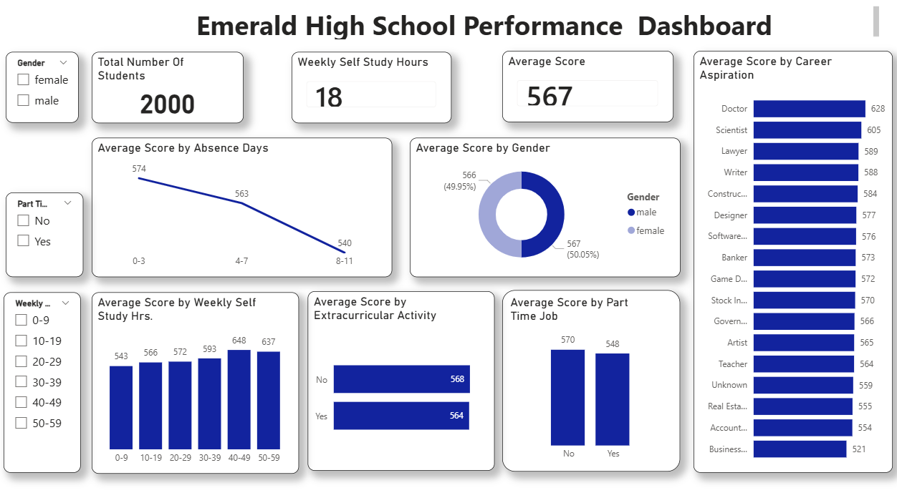
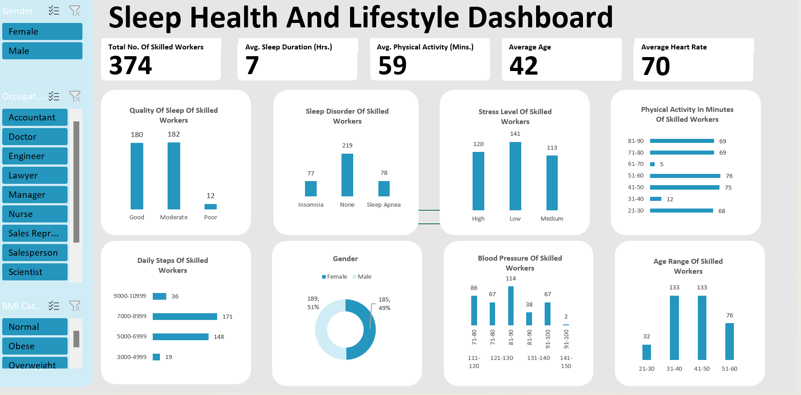

# Data_Analytics_Portfolio
## ABOUT ME

Hello! I'm Aurelia Okafor 🤓, a data analyst  with a strong interest in transforming educational and operational data into meaningful insights that support data-driven decision-making. I enjoy working with data to uncover patterns, trends, and opportunities for improvement.

 

<!--Mention your top/relevant skills here - core and soft skills-->

## Core Skills (Technical Skills)

As a data analyst, I possess strong technical skills that enable me to collect, clean, analyze, and visualize data effectively to support decision-making.

- **Data Analysis & Cleaning:** Preparing, validating, and transforming raw data to ensure accuracy and reliability  
- **Excel:** Advanced formulas, pivot tables, dashboards, data validation, and reporting  
- **SQL:** Writing complex queries using joins, subqueries, aggregations, and filtering to extract insights from databases  
- **Power BI:** Data modeling, DAX calculations, interactive dashboards, and performance reporting  
- **Tableau:** Creating clear, insightful visualizations and dashboards for data storytelling  
- **Data Visualization:** Presenting insights in a visually compelling and easy-to-understand format  
- **Reporting & Documentation:** Translating analysis results into actionable reports and presentations  

---

## Soft Skills

In addition to technical expertise, I bring strong soft skills that are essential for effective data analysis and collaboration.

- **Analytical & Critical Thinking:** Ability to interpret data, identify patterns, and draw meaningful conclusions  
- **Problem-Solving:** Using data-driven approaches to address business and operational challenges  
- **Attention to Detail:** Ensuring data accuracy, consistency, and integrity throughout the analysis process  
- **Communication Skills:** Explaining complex data insights clearly to both technical and non-technical stakeholders  
- **Collaboration & Teamwork:** Working effectively with cross-functional teams to achieve shared goals  
- **Time Management:** Managing multiple tasks and deadlines efficiently  
- **Adaptability & Continuous Learning:** Staying current with evolving tools, techniques, and industry trends  

---

<!--Section 2: List 3-4 key projects-->
## MY PORTFOLIO 

*Have a look at some of the projects I have done.*

**Student Performance Report.**

---

I analysed 2,000 rows of data in seven subjects to support student performance in a school. Most students performed better in Math, English and Physics compared to the other subjects.
My insights guided the school to Monitor work and extracurricular hours to prevent overload; prioritize academic tasks and provide free or affordable tutoring services in all the subjects to ensure students receive the necessary support to succeed academically.

[Click here](Student.pdf)
if you liked it see the full dashboard on my linkedin 
<a href="https://www.linkedin.com/in/aureliaaokafor/recent-activity/all/"> go here </a>

---

**Sleep Health and Lifestyle Analysis**

I analysed 374 rows of data Of skilled workers with normal, obese and overweight body mass index. Those wwho had normal body mass index had better quality of sleep, blood pressure and stress level outcomes.
My insights guided the hospital to implement dietary changes,increase physical activity, weight reduction management and improve on sleep hygiene for those in the obese and overweight group.

[Click here](Sleep-Health-and-Lifestyle-Report.pdf)

**Predictive Modeling and Hypothesis Testing using Titanic Dataset.**

Unfortunately, there weren’t enough lifeboats for everyone onboard, resulting in the death of 1502 out of 2224 passengers and crew. 

<a href="17 How to Present Data to Executives by Anietie Etuk.pdf">Download the Report here (pdf file)</a>

## CONTACT DETAILS

*Like what you see? Let's Connect!*
<table>
  <tbody>
    <tr>
      <td>📧 Send me an email at</td>
      <td><a href="mailto:aureokafor2@gmail.com">aureokafor2@gmail.com</a></td>
    </tr>
    <tr>
      <td>☎️ Give me a call </td>
      <td>(+234) 8037136689</td>
    </tr>
    <tr>
      <td>📍</td>
      <td>Lagos, Nigeria</td>
    </tr>
    <tr>
      <td>📑</td>
      <td><a href="Cv.pdf">Download my CV</a></td>
    </tr>
    <tr>
      <td> ℹ️ </td>
      <td><a href="https://www.linkedin.com/in/aureliaaokafor/">Connect with me on Linkedin</a></td>
    </tr>
  </tbody>
</table>
